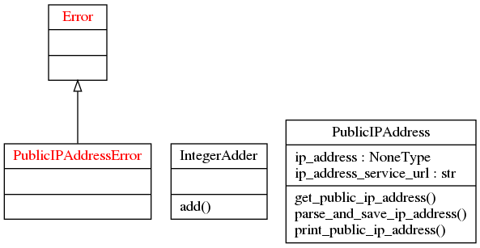

# PythonAwesomeApp
A source-code template for Python3 applications.

## Quick-Start
*Please note that, as of now, these instructions are applicable to linux based systems (Ubuntu). Support for MacOS & Windows will be coming soon.*

### Creating a Python project based on this template
* Install cookiecutter
  
  `pip install --user cookiecutter`

* Create a python project
  
  `python3 -m cookiecutter https://github.com/afaquejam/PythonAwesomeAppTemplate.git`

### Running this app
* Clone this source-code repository:

  `git clone git@github.com:afaquejam/PythonAwesomeApp.git`

* Set up the Python's Virtual Env.
  ```
  python3 -m venv virtualenv
  source virtualenv/bin/activate
  ```
* Install dependencies:

  `pip3 install -r requirements.txt`

* Run the app:
  
  `make`

* Run the tests:

  `make test`
  
* If you'd like to upgrade the project's dependencies:

  `make upgrade-dependencies`

* Turn off the Python VirtualEnv.

  `deactivate`

## Source-Code Organization
* Source-code organization guidelines are [here](docs/source_code_org.md). Please note that in this project, `__init__.py` has been used because it was a requirement of the  `pyreverse` tool.
* The source-code organization of this project looks as show below. Please note that some directories have not been shown for readability purposes.
```
.
├── __init__.py
├── awesome_app
├── package_one
│   ├── __init__.py
│   ├── module_one.py
│   ├── config
│   │   └── integer_adder.cfg
│   └── tests
│       └── test_integer_adder.py
.
.
.
├── makefile
├── LICENSE
├── CHANGELOG.md
├── README.md
└── requirements.txt
```

## Testing & Mocking
* Use Pytest.
  - Use pytest fixtures for set-up and teardown functions.
  - Use parameterized tests.
  - Use pytest-cov to generate test reports.
  - Use pytest plugins to enhance your test reports.
* Mocking
  - Use unittest.mock
* Run: `make test_report` to see the test reports and code-coverage.

## Profiling
* Measuring running time of a program:
  ```
  python3 -m cProfile -o app.prof awesome_app
  snakeviz app.prof
  ```
* Measuring Memory Consumption of a program:
  ```
  mprof run ./awesome_app
  mprof plot
  ```

* Measuring I/O
  - Network: `nethogs`
  - Disk: `iotop`
  - Both provide rudimentary interface to view the I/O information.

## Linting
* PEP 8 style guide (https://bit.ly/1ARqSBt) is recommended.
* Automate linting in your favorite code-editor.
* For example, in Visual Studio Code, install the `Python` package which will automate the linting for your python source-code.

## Documentation
* Changelog, git-tagging & release notes.
  - Changelog guidelines by `Keep a Changelog` are recommended: https://keepachangelog.com/en/1.0.0/
  - Use `git-tags` to tag your git repository and keep it consistent with the changelog.
  - Maintaining release notes is up-to you how you maintain them. Example release notes: https://atom.io/releases
  - You might argue that what's the difference between between changelog and release notes? In my opinion, changelog is much more verbose than release notes. However it's up-to you how you differentiate between them.

* User documentation
  - Please make sure you have instructions how to install your software, it's dependencies and run it.

* Developer documentation
  - Make sure you have relevant documentation for developers such that they can navigate, read, understand and contribute to the project.

## Packaging & Release
* There are different ways to package a Python app depending on how it's going to be used. Here's a nice introduction on the topic: https://docs.python-guide.org/shipping/packaging/
* If the app you're developing is a library, then packaging it  as a `wheel` distribution and/or uploading it to PyPI is an option. Here's a good tutorial on it: https://packaging.python.org/tutorials/packaging-projects/
* If you're distributing your app as a standalone application, then `pyinstaller` is the magical tool for you. This tool can produce a self-contained single app file, which contains the Python interpreter, the app and it's dependencies, for all Mac, Windows & Linux. Steps to create a distribution package for your app (it'll produce binaries for the OS on which it's built):
  - One time step: `pip3 install pyinstaller`
  - `pyinstaller awesome_app -n awesome_app --onefile`
  - In this case, `awesome_app` is the main script which gets executed and `-n` option is the name of the app.
  - This will create the app binary `dist` folder. Copy and distribute. Simple as that!

## Concurrency & Parallelism
* Concurrent programs can be written using Python's `threading` module. However, please note that due to the Global Interpretor Lock (GIL) in CPython & PyPy, threads will not execute in parallel.
* If you want to achieve true parallelism on a multi-core processor system, then `multiprocessing` module provides a way to spawn multiple processes, which can run parallely.
* Python provides good thread and process synchronization mechanisms. You can check their respective sync. mechanisms.
* Queues are recommended ways for inter-thread and inter-process communication.
* Relevant resources:
  - `threading`: https://pymotw.com/3/threading/index.html
  - `multiprocessing`: https://pymotw.com/3/multiprocessing/index.html
  - Thread sync mechanisms: https://docs.python.org/3/library/threading.html#lock-objects
  - Process sync mechanisms: https://docs.python.org/3.7/library/multiprocessing.html#synchronization-between-processes
  - Queue: https://pymotw.com/3/queue/index.html

## Async.
* `async` and `await` is the way to go (v3.5 & above).
* The documentation on this topic not good.
* A talk on this topic from its creator: https://www.youtube.com/watch?v=m28fiN9y_r8
* Other resource: https://pymotw.com/3/asyncio/

## Improving Performance: PyPy
* Pypy claims to be approx. 7 times faster than CPython. It's generally useful in case your app runs for a long time, in contrast to a Python script which just does one-off operation.
* Tread carefully, since we're in the realm of performance optimization. I agree with taking the following steps before performing any optimization:
  - Measure app performance.
  - Profile your code.
  - Optimize.
* Also, please identify if your app's core logic is `compute-bound` or `I/O bound`. With PyPy, `compute-bound` code can be optimized.

## PyReverse
* Using PyReverse, you can generate UML diagrams for your app. This can be helpful in understanding and refactoring your code.
* Installation: `sudo apt-get install pylint`
* Usage (run this command from outside the project's directory): `pyreverse -o png -p PythonAwesomeApp PythonAwesomeApp/`
* Class diagram of this app: 
